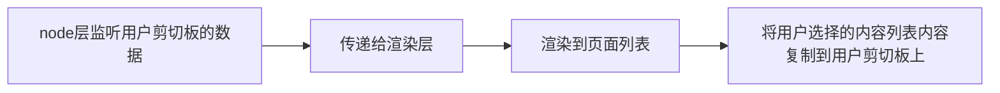

## 文章概述
本文是作者在写了第一个 electron 练手项目`剪切板管理`之后，记录的一些知识点，技术难度为入门级别；涉及到的知识点包括1)对 electron 的理解;2)剪切板管理功能的实现; 3)indexDb 在 vue3 的使用;

## 关键词
electron、vite、clipboard、vue3、入门

## 项目地址
[my-clipboard](https://github.com/mamumu123/my-clipboard)


## 对 Electron 的理解

### Electron 是什么
> Electron 是一个基于 Chromium 和 Node.js 的桌面应用开发框架。Electron 允许开发者使用前端技术（如 HTML、CSS 和 JavaScript）构建跨平台的桌面应用程序，并通过 Node.js 提供的原生 API 访问底层系统功能。

### electron 目录结构
一个最简单的 electron 项目，包含这样几个文件：
|文件|功能描述|
|--|--|
|renderer.js|处理用户界面和与用户交互|
|main.js| 应用程序的入口点，用于处理与操作系统交互的任务|
|preload.js| 在渲染进程中注入一些额外的功能|
| package.json | 依赖管理|

其中， renderer.js 就相当于前端页面； main.js 就是 node 层；preload 两者环境都可以访问，所以可以给渲染层提供一些原生能力。

### 前端开发对 electron 的理解
从一个前端开发的角度来看， electron 就是在 web 开发的能力之上，还通过 Node.js 提供了访问原生 API 的能力。

### 什么时候选择 electron, 什么选择纯 web 页面。
1. 如果你的项目需要用到`原生能力`，例如需要访问本地文件系统、系统通知、硬件设备等，那么 Electron 是一个很好的选择;
2. 如果需要更好的性能和稳定性，可以使用桌面端。

### 关于套壳的客户端
如果仅仅需要一个套壳的客户端，并不需要访问原生 api 的能力。那么可以考虑一键生成套壳应用。 [Pake](https://github.com/tw93/Pake)


```bash
pake <url> --name <name> --transparent
```

## 开发记录

### 功能介绍
这次的练手项目准备使用 Electron 构建一个剪贴板管理器，帮助用户轻松管理和搜索剪贴板历史记录。

### 项目初始化
- folk (复制模板)
- clone (下载项目)
- yarn install (安装)
- npm run dev (运行项目)

#### 模板选择
使用了社区 star 比较高的 [electron-vite-vue]() 模板。这样对于作者来说，可以同时学习 vite, vue3, electron 三个技术点。

（使用以后，体验还不错，基本上没啥要改的，安装完以后以后，就可以直接进行业务开发）

#### 安装
`yarn install` 报了失败， 原因是 node 版本要求比较高，需要升级到 18+ 或者 20+。所以需要使用 nvm 进行版本切换。
```bash
nvm install 20
nvm use 20
```
顺便将默认版本设置为最新，不然每次重开电脑，又会遇到 node 版本的问题。
```bash
nvm alias default v20.12.2 # v20 版本
```

### 功能实现


剪切板管理的功能比较简单，拆分一些需求细节，主要包括:
-  轮询监听，获取到用户剪切板的数据；
- 通过 IPC 通信，传递给渲染层；
- 渲染层获取到数据以后，渲染到页面列表;
- 用户点击其中列表项，将列表内容复制到用户剪切板上;

#### 监听用户剪切板的数据
使用轮询，不断的获取用户的剪切板内容，当发现和之前不一样时，说明是我们需要记录的内容；
```js
import { BrowserWindow, clipboard } from 'electron';
let previousText = '';
export async function subscribeClipboard(win: BrowserWindow) {
    setInterval(() => {
        const text = clipboard.readText();
        if (text && text !== previousText) {
            // do something
            previousText = text;
        }
    }, 1000);
}
```

#### 通过 IPC 通信，传递给渲染层
```js
win.webContents.send('clipboard-change', text);
```

#### 渲染层获取数据
```js
window.ipcRenderer.on('clipboard-change', (_event, value) => {
    // do something
});
```

### 打包

```bash
npm run build
# vue-tsc --noEmit && vite build && electron-builder
```
分为三部分
- ts 类型检查，不输出任何文件
- 生成文件，其中 renderer 生成到 dist; main 和 preload 生成到 dist-electron;
- electron-builder 打包命令。

### electron-builder 
https://www.electron.build/

>  如果没有目标配置，电子构建器将使用默认目标为当前平台和当前架构构建 Electron 应用程序。

### 其他细节点

#### 将关闭改为隐藏
在 main.js 文件中，监听 close 事件，取消默认能力，然后调用隐藏接口；
```js
win.on('close', (event) => {
    event.preventDefault();
    win.hide();
    return false;
});
```

#### 将图标和上下文菜单添加到系统的通知区域

Tray 对应着通知区域，可以增加一个下拉列表，增加一些事件处理。
```js
const tray = new Tray(iconPath);
  const template = [
    {
      label: '打开',
      click: () => win.show(),
    },
    {
      label: '退出',
      click: () => app.exit(),
    }
  ];
  let contextMenu = Menu.buildFromTemplate(template);
  tray.setContextMenu(contextMenu);
```

### 将列表内容复制到用户剪切板上
这个功能也很简单，首先对每一列进行事件绑定，然后在监听到点击以后，将 innerText 写到用户的剪切板上。
```js
export const copyContent = async (text: string) => {
    try {
        await navigator.clipboard.writeText(text);
        message.success('复制成功');
    } catch (err) {
        message.error('复制失败');
    }
}
```


## 增加持续存储能力
使用 indexDb 就要使用到 dexie，这个库对 indexDb 进行了比较不错的封装；

### 在 typescript 中使用 indexDb
在 typescript 中使用，需要创建一个类，这样子会类型友好。

建立一个类，`相当于一个库`; 如果建立表的话，就`声明为属性`。
```typescript
import Dexie from 'dexie';

export class Database extends Dexie {
    history!: Dexie.Table<IHistory, number>; 
    //...other tables goes here...

    constructor() {
        super("Database");
        this.version(1).stores({
            history: '++id, text',
        });
    }
}

export interface IHistory {
    id?: number,
    text: string
}
```

### 在 vue3 中使用
在 Vue 中，我们需要实现响应式数据，以便在数据发生变化后，这些变化能够反映到页面上。Dexie 的文档中提供了具体的[实现案例](https://dexie.org/docs/Tutorial/Vue)，通过和 rxjs 合作来实现这个能力。

```js
useObservable(
    liveQuery(() => db.friends.toArray())
)
// Vue liveQuery：Observable<any[]> 不可分配给 Observable<unknown> 类型的参数
// https://github.com/dexie/Dexie.js/issues/1608
```
但在 Vue 3 中，这些案例并不能正常工作。
社区的一个解决方案是通过 `from` 将 Dexie 可观察对象转换为 RxJs 可观察对象；

```js
import { useObservable, from } from "@vueuse/rxjs";

const historyData = useObservable(
    from(
        liveQuery(async () => {
            return (await db.history.toArray());
        })
    )
);
```

还有一个社区提供的 hooks，也是将 dexie 的可观察对象封装到了 RxJs 流中；
```js
const value = shallowRef<T | I | undefined>(initialValue);

let subscription: Subscription | undefined = undefined;

function start() {
    subscription?.unsubscribe();

    const observable = liveQuery(querier);

    subscription = observable.subscribe({
        next: result => {
            value.value = result;
        },
        error: error => {
            onError?.(error);
        },
    });
}

```


## TODO
- [ ] 完善能力
    - [ ] 增加对图片等类型的支持；
    - [ ] 增加保存能力
    - [ ] 完善细节，让自己能够真的用起来
 

## 参考

### 剪辑器管理
https://github.com/unlimited-clipboard/unlimited-clipboard

https://github.com/azure06/clips


### 文档
[dexie 官网](https://dexie.org)

[antd-vue 官网](https://antdv.com/components/table-cn)

[electron 官网](https://www.electronjs.org/)

[useDexieLiveQuery](https://github.com/devweissmikhail/useDexieLiveQuery/blob/main/README.md)